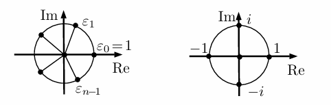

## Билет 5

### Извлечение корня из комплексного числа. Корни из 1.

#### Извлечение корня из комплексного числа

- Пусть $a \in \mathbb{C}$ и $n \in \mathbb{N}$ фиксированы, $a \neq 0$. Решим уравнение $z^n = a$.
- Будем использовать представление комплексных чисел через модуль и аргумент. Тогда $a = (r, \varphi)$ (параметры даны) и $z = (p, \psi)$ (эти параметры мы ищем).
- По формуле Муавра, $p = \sqrt[n]{r}$.
- С аргументом сложнее. По формуле Муавра, $n\psi = \varphi + 2\pi k$, где $k \in \mathbb{Z}$ (напомним, что аргумент вычисляется с точностью до $2\pi k$). Поделив на $n$, получаем $\psi = \frac{\varphi}{n} + \frac{2\pi k}{n}$.
- При $k \in \{0, 1, \ldots, n-1\}$ в (1) получается $n$ разных аргументов.
- Каждое число $k \in \mathbb{Z}$ можно представить в виде $k = qn + t$, где $0 \leq t < n$ (это теорема о делении с остатком). Тогда $\frac{2\pi k}{n} = \frac{2\pi t}{n} + 2\pi q$, а это тот же аргумент, что и $\frac{2\pi t}{n}$.
- Таким образом, корень $n$-й степени извлекается из $a \neq 0$ ровно $n$ способами.

#### Корни из 1

- Отдельно рассмотрим корни $n$-й степени из 1 — решения уравнения $z^n = 1$.
- Из сказанного выше следует, что модуль всех корней из 1 равен 1. Так как $\arg(1) = 0$, все различные аргументы считаются по формуле $\psi_k = \frac{2\pi k}{n}$, где $k \in \{0, \ldots, n-1\}$.
- Обозначим их $\varepsilon_0, \ldots, \varepsilon_{n-1}$ (корень $\varepsilon_k$ имеет аргумент $\psi_k$).
- Корни из 1 степени $n$ лежат на окружности радиуса 1 в вершинах правильного $n$-угольника, одна из которых — в 1.
- По формуле Муавра $\varepsilon_k = \varepsilon_1^k$. Значит, все корни из 1 — это степени $\varepsilon_1$.
- 
- На рисунке справа изображены корни степени 4 из 1. Один из них — это $i = (0,1)$ ($\arg(i) = \frac{\pi}{2}$).
- Остальные корни из 1 степени 4 — это $-1 = i^2$, $-i = i^3$ и $1 = i^4$.
- Комплексное число $z = (a,b)$ может быть записано в виде $z = a + bi$, который многим из вас более привычен.
- Еще одно часто встречающееся обозначение — комплексное число $z$ с $|z| = 1$ и $\arg(z) = \alpha$ часто записывают в виде $z = e^{i\alpha}$.
- Таким образом, $e^{i\alpha} = (\cos(\alpha), \sin(\alpha))$.
