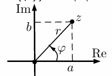

## Билет 1

### Вещественная и мнимая часть, умножение, сложение, норма, модуль.

#### Определение

- Множество комплексных чисел состоит из упорядоченных пар вещественных чисел: $C=\{(a,b) : a,b \in \mathbb{R}\}$.
- Сложение: $(a,b) +(a',b') := (a + a',b + b')$.
- Умножение: $(a,b) \cdot (a',b') := (aa' - bb',ab' + ba')$.

#### Определение

- Пусть $z = (a,b) \in C$.
- Вещественная часть $z$ — это $Re(z) := a$.
- Мнимая часть $z$ — это $Im(z) := b$.
- Комплексное сопряжение: $\overline{z} := (a,-b)$.
- Норма $z$ — это $N(z) := a^2 + b^2$.
- Модуль $z$ — это $|z| := \sqrt{N(z)}$.
- Очевидно, $\overline{\overline{z}} = z$.

## Билет 2

### Поле комплексных чисел.

#### Теорема 1
$C$ — поле.
Доказательство:
- 1) и 2) Так как сложение в $C$ — покомпонентное, ассоциативность и коммутативность наследуются из $\mathbb{R}$.
- 3) Ноль в $C$ — это $0 := (0,0)$.
- 4) Обратный элемент по $+$. Для $z = (a,b)$ положим $-z := (-a,-b)$.
- 7) Коммутативность умножения:
$(a, b) \cdot (a',b') = (aa' - bb',ab' + ba') = (a'a - b'b,a'b + b'a) = (a',b') \cdot (a,b)$.
- 5) Достаточно проверить одну дистрибутивность (так как умножение коммутативно):
$(a, b) \cdot ((c_1,d_1) + (c_2,d_2)) = (a,b) \cdot (c_1 + c_2,d_1 + d_2) = (ac_1 + ac_2 - bd_1 - bd_2,ad_1 + ad_2 + bc_1 + bc_2) = (ac_1 - bd_1,ad_1 + bc_1) + (ac_2 - bd_2,ad_2 + bc_2) = (a,b) \cdot (c_1,d_1) + (a,b) \cdot (c_2,d_2)$.
- 6) Ассоциативность умножения:
$(a_1, b_1) \cdot (a_2, b_2) \cdot (a_3,b_3) = (a_1a_2 - b_1b_2,a_1b_2 + b_1a_2) \cdot (a_3,b_3) = (a_1a_2a_3 - b_1b_2a_3 - a_1b_2b_3 - b_1a_2b_3,a_1b_2a_3 + b_1a_2a_3 + a_1a_2b_3 - b_1b_2b_3)$. Нетрудно проверить, что при д��угом порядке получится то же самое (в вещественную часть попадают сомножители с четным числом $b$, в ��нимую — с нечетным, знак $-$ получается там, где более одной $b$).
- 8) Единица: это $1 := (1,0)$.
- 9) Обратный элемент по $\cdot$. Для $z = (a,b)$ положим $z^{-1} := \left( \frac{a}{N(z)}, \frac{-b}{N(z)} \right)$. Проверяем:
$z z^{-1} = (a,b) \cdot \left( \frac{a}{N(z)}, \frac{-b}{N(z)} \right) = \left( \frac{a^2 + b^2}{N(z)}, \frac{-ab + ba}{N(z)} \right) = (1,0)$.

## Билет 3

### Тригонометрическая форма записи комплексного числа. Изменение модуля и аргумента при перемножении комплексных чисел. Формула Муавра.

#### Геометрическая интерпретация $C$ и тригонометрическая запись

- Рассмотрим декартову систему координат в $\mathbb{R}^2$, по оси абсцисс будем откладывать ве��ественную часть, а по оси ординат — мнимую. Тогда комплексное сопряжение — симметрия относительно оси абсцисс.
- Для числа $z = (a,b) \in C$ тогда $r = |z| = \sqrt{a^2 + b^2}$ — расстояние от начала координат до $z$.
- Аргумент $z$ — это направленный угол $\arg(z) = \varphi$ от оси абсцисс до луча $Oz$ против часовой стрелки. Вычисляется с точностью до прибавления $2\pi k$, где $k \in \mathbb{Z}$.
- Пара $(r,\varphi)$ однозначно задает точку $z$.
- $a = r \cos(\varphi)$, $b = r \sin(\varphi)$.
- Тригонометрическая форма записи комплексного числа: $z = (r \cos(\varphi), r \sin(\varphi))$.
- Если $z = (r \cos(\varphi), r \sin(\varphi))$, то $|z| = r$, $\arg(z) = \varphi$.

### Теорема 2
Пусть $x,y \in C$. Тогда $|xy| = |x||y|$ и $\arg(xy) = \arg(x) + \arg(y)$.
Доказательство:
- Пусть $x = (r \cos(\varphi), r \sin(\varphi))$, а $y = (p \cos(\psi), p \sin(\psi))$. Тогда
$$
xy = rp(\cos(\varphi)\cos(\psi) - \sin(\varphi)\sin(\psi)), rp(\cos(\varphi)\sin(\psi) + \sin(\varphi)\cos(\psi)) = rp \cos(\varphi + \psi), rp \sin(\varphi + \psi)
$$
- Следовательно, $|xy| = rp$ и $\arg(xy) = \varphi + \psi$.

### Теорема 3
Формула Муавра. Пусть $z \in C$, $n \in \mathbb{N}$. Тогда $|z^n| = |z|^n$ и $\arg(z^n) = n \cdot \arg(z)$.
Доказательство. Индукция по $n$. База $n = 1$ очевидна.
Переход $n \to n+1$.
- Пусть $|z| = r$, $\arg(z) = \varphi$ и утверждение доказано для $n$, то есть, $|z^n| = r^n$ и $\arg(z^n) = n\varphi$.
- По Теореме 2 $|z^{n+1}| = |z||z^n| = r \cdot r^n = r^{n+1}$ и $\arg(z^{n+1}) = \arg(z) + \arg(z^n) = \varphi + n\varphi = (n + 1)\varphi$.

## Билет 4

### Вложение вещественных чисел в комплексные.

#### Лемма 1
Отображение $f : \mathbb{R} \to \mathbb{C}$, заданное формулой $f(a) = (a,0)$ — мономорфизм.
Доказательство:
- Очевидно, $f$ — инъекция.
- Нужно проверить, что это гомоморфизм. Пусть $a,b \in \mathbb{R}$.
- $f(a + b) = (a + b, 0) = (a, 0) + (b, 0) = f(a) + f(b)$.
- $f(ab) = (ab, 0) = (a, 0) \cdot (b, 0) = f(a)f(b)$.
- Очевидно, $\text{Im}(f) \cong \mathbb{R}$. Таким образом, $\mathbb{C}$ имеет подполе $\text{Im}(f)$, изоморфное $\mathbb{R}$. В дальнейшем мы будем отождествлять каждое вещественное число $a$ с комплексным $(a,0)$.
- Теперь можно сказать, что для любого $z = (a,b) \in \mathbb{C}$ выполнено:
  - $z \cdot \overline{z} = N(z) = a^2 + b^2$
  - $z + \overline{z} = 2\text{Re}(z) = 2a$
- Сопряженные комплексные числа $z, \overline{z} \in \mathbb{C} \setminus \mathbb{R}$ — корни квадратного уравнения с вещественными коэффициентами $t^2 - 2\text{Re}(z) \cdot t + N(z) = 0$.

## Билет 5

### Извлечение корня из комплексного числа. Корни из 1.

#### Извлечение корня из комплексного числа

- Пусть $a \in \mathbb{C}$ и $n \in \mathbb{N}$ фиксированы, $a \neq 0$. Решим уравнение $z^n = a$.
- Будем использовать представление комплексных чисел через модуль и аргумент. Тогда $a = (r, \varphi)$ (параметры даны) и $z = (p, \psi)$ (эти параметры мы ищем).
- По формуле Муавра, $p = \sqrt[n]{r}$.
- С аргументом сложнее. По формуле Муавра, $n\psi = \varphi + 2\pi k$, где $k \in \mathbb{Z}$ (напомним, что аргумент вычисляется с точностью до $2\pi k$). Поделив на $n$, получаем $\psi = \frac{\varphi}{n} + \frac{2\pi k}{n}$.
- При $k \in \{0, 1, \ldots, n-1\}$ в (1) получается $n$ разных аргументов.
- Каждое число $k \in \mathbb{Z}$ можно представить в виде $k = qn + t$, где $0 \leq t < n$ (это теорема о делении с остатком). Тогда $\frac{2\pi k}{n} = \frac{2\pi t}{n} + 2\pi q$, а это тот же аргумент, что и $\frac{2\pi t}{n}$.
- Таким образом, корень $n$-й степени извлекается из $a \neq 0$ ровно $n$ способами.

#### Корни из 1

- Отдельно рассмотрим корни $n$-й степени из 1 — решения уравнения $z^n = 1$.
- Из сказанного выше следует, что модуль всех корней из 1 равен 1. Так как $\arg(1) = 0$, все различные аргументы считаются по формуле $\psi_k = \frac{2\pi k}{n}$, где $k \in \{0, \ldots, n-1\}$.
- Обозначим их $\varepsilon_0, \ldots, \varepsilon_{n-1}$ (корень $\varepsilon_k$ имеет аргумент $\psi_k$).
- Корни из 1 степени $n$ лежат на окружности радиуса 1 в вершинах правильного $n$-угольника, одна из которых — в 1.
- По формуле Муавра $\varepsilon_k = \varepsilon_1^k$. Значит, все корни из 1 — это степени $\varepsilon_1$.
- 
- На рисунке справа изображены корни степени 4 из 1. Один из них — это $i = (0,1)$ ($\arg(i) = \frac{\pi}{2}$).
- Остальные корни из 1 степени 4 — это $-1 = i^2$, $-i = i^3$ и $1 = i^4$.
- Комплексное число $z = (a,b)$ может быть записано в виде $z = a + bi$, который многим из вас более привычен.
- Еще одно часто встречающееся обозначение — комплексное число $z$ с $|z| = 1$ и $\arg(z) = \alpha$ часто записывают в виде $z = e^{i\alpha}$.
- Таким образом, $e^{i\alpha} = (\cos(\alpha), \sin(\alpha))$.

